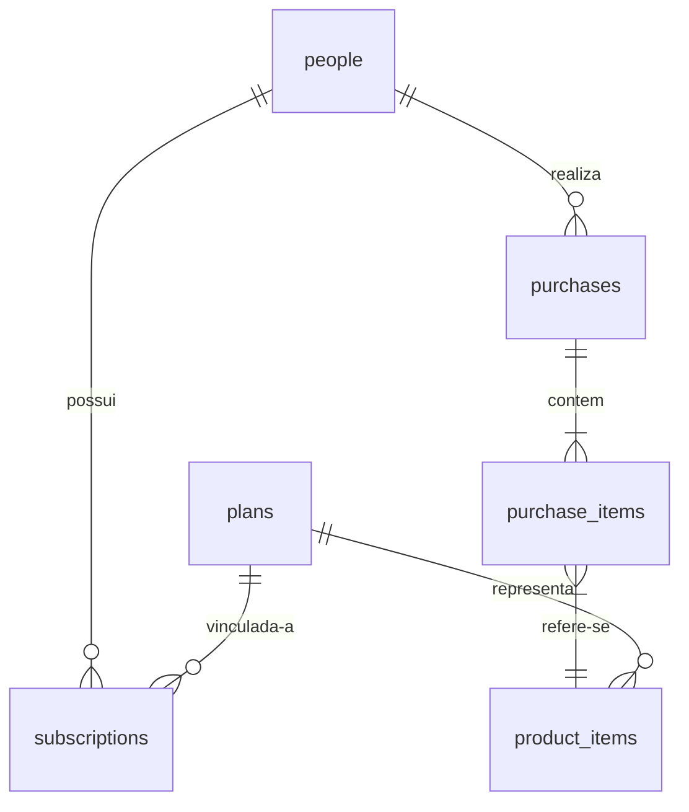

# Documento de Análise e Especificação Técnica — DentalGO BI & CRM

Este documento apresenta uma visão detalhada da arquitetura, estrutura de arquivos, banco de dados, rotas e funcionalidades do sistema **DentalGO BI (Business Intelligence & CRM Comercial)**. O objetivo deste relatório é fornecer uma base sólida para análise técnica, auditorias ou novos desenvolvedores que venham a interagir com o ecossistema do projeto.

---

## 1. Visão Geral do Projeto

O **DentalGO BI** é uma plataforma de inteligência de negócios e painel comercial desenvolvida com **Next.js (App Router)** e **React 19**. Ele foi projetado para integrar métricas de receita (MRR, vendas avulsas, assinaturas) vindas de um banco de dados MySQL de produção da DentalGO e fornecer um cockpit de CRM para gerenciamento de leads e funil comercial.

O painel opera em modo **100% Read-Only** no banco de dados principal (para garantir a integridade dos dados transacionais), enquanto as anotações do CRM e as alterações de estágio do funil são gravadas e mantidas localmente em um arquivo JSON estruturado.

---

## 2. Tecnologias e Linguagens Utilizadas

A pilha de tecnologia do projeto consiste em:

*   **Linguagens**: TypeScript (Front-end e APIs), JavaScript (Scripts auxiliares de análise e teste), SQL (Consultas analíticas ao banco de dados).
*   **Front-end & Framework**: Next.js 16.2.1 (App Router), React 19.2.4.
*   **Visualização de Dados**: Recharts v3.8.1 (Componentes prontos para relatórios gráficos adicionais).
*   **Estilização**: Tailwind CSS v4 com PostCSS, variáveis nativas CSS no arquivo global e estilos inline estruturados para componentes dinâmicos.
*   **Banco de Dados**: MySQL, acessado via driver assíncrono `mysql2/promise` com suporte a pool de conexões e criptografia SSL.
*   **Infraestrutura & Deploy**:
    *   **Docker**: Dockerfile multi-stage otimizado para produção.
    *   **Docker Compose**: Orquestração do serviço do painel com mapeamento de rede externa para comunicação com o clone do banco de dados.
    *   **Nginx**: Configuração de proxy reverso e gerenciamento de tráfego na porta 80.
    *   **Git / Bash**: Script de deploy automatizado (`deploy.sh`).

---

## 3. Estrutura e Árvore de Arquivos

Abaixo está o mapeamento dos principais diretórios e arquivos que compõem o repositório:

```text
GODASH/
├── .env.local                    # Configuração de credenciais do banco local/desenvolvimento
├── .env                          # Configurações do banco de produção (DigitalOcean Managed MySQL)
├── .dockerignore                 # Regras de exclusão para o build Docker
├── .gitignore                    # Regras de exclusão do controle de versão do Git
├── Dockerfile                    # Arquivo de build de imagem Docker multi-stage (builder/runner)
├── docker-compose.yml            # Configuração de containers Docker e vinculação de redes
├── nginx.conf                    # Template de configuração de proxy reverso Nginx
├── deploy.sh                     # Script automatizado para puxar código do Git e reiniciar containers
├── package.json                  # Dependências, metadados e scripts NPM
├── tsconfig.json                 # Configurações do TypeScript
├── eslint.config.mjs             # Configurações de linting de código
├── postcss.config.mjs            # Configuração de processamento de CSS
├── test-connection.js            # Script utilitário para testar conexão MySQL no terminal
├── analyze_intent.js             # Script de análise de comportamento de conversão de leads (Mar/2026)
├── public/                       # Arquivos estáticos (imagens, favicon, etc.)
└── src/
    ├── components/               # Componentes UI reutilizáveis
    │   ├── ui/
    │   │   ├── KpiCard.tsx       # Componente de cartão KPI
    │   │   ├── MonthSelector.tsx # Seletor dinâmico de competência (mês)
    │   │   └── PlanSelector.tsx  # Seletor de planos de assinatura
    │   ├── charts/               # Componentes de gráficos (Recharts)
    │   │   ├── ChurnChart.tsx
    │   │   ├── CohortTable.tsx
    │   │   ├── ExpiringTable.tsx
    │   │   ├── GrowthTrendChart.tsx
    │   │   ├── PlanDistributionChart.tsx
    │   │   └── RevenueChart.tsx
    │   ├── ThemeProvider.tsx     # Context Provider para controle de tema Claro/Escuro
    │   └── ThemeToggle.tsx       # Botão de alternância de tema na barra superior
    ├── lib/                      # Utilitários e arquivos de conexão/configuração backend
    │   ├── db.ts                 # Conexão MySQL via mysql2 utilizando pool de conexões
    │   ├── queries.ts            # Centralizador de consultas SQL analíticas (Read-Only)
    │   └── crm_store.json        # Arquivo local de persistência para as notas e estágios do CRM
    └── app/                      # Rotas e páginas do Next.js (App Router)
        ├── favicon.ico
        ├── globals.css           # Variáveis de estilo de cores, temas, e classes utilitárias
        ├── layout.tsx            # Layout de entrada raiz com ThemeProvider e fontes do Google
        ├── page.tsx              # Página inicial (redireciona automaticamente para /dashboard)
        └── dashboard/            # Módulo Principal do Painel
            ├── page.tsx          # Server Component para buscar dados de API iniciais (KPIs e Usuários)
            ├── DashboardContent.tsx # Client Component interativo contendo CRM, Kanban e listagens
            └── api/              # Endpoints HTTP da API Interna
                ├── churn/        # API de taxas de churn e análise de coorte
                ├── commercial/   # API de extrações e relatórios comerciais (JSON/CSV)
                ├── crm/          # API de leitura/gravação das anotações locais do CRM
                ├── kpis/         # API de métricas de cabeçalho consolidadas
                ├── revenue/      # API de tendências diárias de receita e vendas
                ├── subscriptions/# API de assinaturas prestes a expirar
                └── users/        # API de usuários cadastrados por competência
```

---

## 4. Banco de Dados e Conexões

### Configuração de Conexão (`src/lib/db.ts`)
A conexão é criada como um pool de conexões reutilizável (`mysql.createPool`) configurado para manter conexões ativas (`enableKeepAlive`) e otimizar recursos. 

O painel é compatível com bancos de dados locais (via `.env.local`) ou gerenciados em nuvem (como **DigitalOcean Managed MySQL**, configurado em `.env`). Bancos em nuvem possuem ativação automática de SSL (`DB_SSL=true`) com rejeição de certificados não autorizados desativada (`rejectUnauthorized: false`), exigida pelas políticas da DigitalOcean.

### Estrutura de Entidades / Tabelas do Banco de Dados
Abaixo estão as tabelas consumidas pelas consultas SQL localizadas em `src/lib/queries.ts`:



1.  **`people` (Clientes/Leads)**
    *   `id`: Identificador único numérico (Chave Primária).
    *   `fullName`: Nome completo do cliente.
    *   `email`: Endereço de e-mail.
    *   `phoneNumber`: Telefone/WhatsApp formatado.
    *   `admin`: Sinalizador se o usuário é administrador (onde `admin = 0` indica cliente regular).
    *   `createdAt`: Data e hora em que o cadastro foi criado.
2.  **`subscriptions` (Assinaturas)**
    *   `id`: Identificador da assinatura.
    *   `status`: Status do contrato (ex: `'active'`, `'canceled'`).
    *   `planId`: Relacionamento com o plano contratado (FK para `plans.id`).
    *   `personId`: Relacionamento com o usuário (FK para `people.id`).
    *   `isValidUntil` / `expiresIn`: Data de expiração ou expiração futura da assinatura.
    *   `createdAt`: Data de início da assinatura.
    *   `canceledAt`: Data em que a assinatura foi cancelada (caso o status seja cancelado).
3.  **`plans` (Planos)**
    *   `id`: Identificador do plano.
    *   `title`: Nome comercial do plano (Ex: *Plano Anual Premium*, *Plano Mensal Recorrente*, *Plano Scholar*).
    *   `price`: Valor da cobrança (decimal/inteiro).
    *   `intervalType`: Frequência de renovação (Ex: `'year'`, `'month'`).
4.  **`purchases` (Transações de Pagamento)**
    *   `id`: Identificador da compra.
    *   `status`: Status do pagamento (Ex: `'success'`).
    *   `total`: Valor total transacionado.
    *   `createdAt`: Data e hora da compra.
    *   `personId`: Usuário que realizou a transação (FK para `people.id`).
5.  **`purchase_items` (Itens de Compra)**
    *   `purchaseId`: Identificador da compra correspondente.
    *   `productItemId`: Identificador do item de produto adquirido (FK para `product_items.id`).
6.  **`product_items` (Itens de Produtos)**
    *   `id`: Identificador do item de produto.
    *   `productId`: Chave vinculada ao ID do plano contratado (`plans.id`).

---

## 5. Rotas e Endpoints da API

Todas as rotas de API do backend retornam objetos JSON estruturados e tratam erros de banco de dados por meio de fallbacks de dados de demonstração (Mock Data), impedindo que falhas de conexão derrubem a interface do usuário.

### Rotas de Interface (Frontend)
*   **`/`**: Redirecionamento automático (`next/navigation redirect`) para `/dashboard`.
*   **`/dashboard`**: Renderiza a interface do painel. A rota é um Server Component que recebe a query string `?month=YYYY-MM` para definir a competência de análise antes de injetar os dados no painel interativo.

### Endpoints da API Interna (`/src/app/api/...`)

#### 1. KPIs Consolidados (`GET /api/kpis?month=YYYY-MM`)
*   **Objetivo**: Consolida métricas-chave do período e dados locais do CRM.
*   **Métricas Computadas**:
    *   `acquisitions`: Total de cadastros em `people` no mês selecionado.
    *   `activeSubscriptions`: Contagem total de assinaturas ativas na plataforma.
    *   `churnCount`: Contagem de assinaturas marcadas como canceladas (`status = 'canceled'`) dentro do mês selecionado.
    *   `churnRate`: Percentual de cancelamentos em relação ao total de assinaturas ativas.
    *   `crm`: Resumo do CRM local contendo total de leads em interação, distribuição por estágios e total de notas inseridas.

#### 2. Usuários por Competência (`GET /api/users?month=YYYY-MM`)
*   **Objetivo**: Retorna a lista detalhada de leads cadastrados no mês selecionado.
*   **Campos**: Nome, e-mail, telefone, data de cadastro e o plano ativo do cliente. Se o cliente não possuir assinatura vinculada, o endpoint pesquisa o histórico de compras recentes do usuário no banco ou retorna `'Sem Plano / Cadastro Grátis'`.
*   **Resiliência**: Se a conexão com o banco falhar, o sistema serve automaticamente uma lista simulada de 15 leads de demonstração.

#### 3. Integração com o CRM Local (`GET` e `POST` `/api/crm`)
*   **Objetivo**: Leitura e gravação de estados do CRM local armazenados em `src/lib/crm_store.json`.
*   **`GET`**: Retorna o estado atual de todos os leads modificados (estágios e notas).
*   **`POST`**: Atualiza ou cria a entrada de um lead específico no arquivo de banco plano JSON.
    *   **Body esperado**: `{ emailOrId: string, stage?: string, note?: string }`
    *   Se `stage` for fornecido, altera a coluna do funil em que o lead se encontra.
    *   Se `note` for fornecido, adiciona um objeto de anotação (`{ date: ISOString, text: string }`) ao topo do histórico de interação do lead.

#### 4. Extração Comercial de Leads (`GET /api/commercial/extract`)
*   **Objetivo**: Filtra e exporta relatórios segmentados de leads em formato **JSON** ou arquivo **CSV** para download direto. Recebe os parâmetros `type`, `format` (json/csv), `month` e `planId`.
*   **Tipos de Extração Comercial (`type`)**:
    *   `recovery` (Recuperação): Assinantes core ativos que não realizaram nenhum pagamento recente de renovação nos últimos 45 dias.
    *   `expiring` (Renovação): Assinantes core ativos cujo vencimento da assinatura ocorrerá entre a data atual e os próximos 60 dias.
    *   `abandoned` (Cadastro Abandonado): Leads cadastrados no sistema que não possuem nenhuma assinatura registrada nem compras bem-sucedidas. Filtra automaticamente nomes e e-mails suspeitos de robôs/bots.

#### 5. Taxas de Churn e Retenção (`GET /api/churn?months=12&month=YYYY-MM`)
*   **Objetivo**: Computa tendências históricas mensais de cancelamentos versus novas ativações de assinaturas da base principal, além de estruturar a tabela de coorte (Cohort Retention) dos últimos 12 meses.

#### 6. Faturamento e Receita (`GET /api/revenue?month=YYYY-MM`)
*   **Objetivo**: Mapeia o crescimento de receita e volume diário de vendas do mês selecionado. Retorna um array com o acumulado diário de novos assinantes ativos, renovações de planos, eventos de churn e contagem de vendas de produtos avulsos.

#### 7. Assinaturas Próximas do Vencimento (`GET /api/subscriptions?days=60`)
*   **Objetivo**: Lista os assinantes com vencimento agendado para os próximos `N` dias que pertençam aos planos principais (Core).

---

## 6. Funcionalidades do Cockpit de CRM

O cockpit interativo (`src/app/dashboard/DashboardContent.tsx`) oferece uma experiência comercial rica e de alta fidelidade:

*   **Filtros Rápidos e Barra de Pesquisa**: Permite filtrar a lista de leads dinamicamente por nome, e-mail, telefone ou plano de assinatura.
*   **Integração com WhatsApp**: Gera automaticamente links de direcionamento para o WhatsApp Web ou aplicativo, limpando caracteres especiais dos telefones e prefixando o código de país do Brasil (`55`).
*   **Controle de Funil por Lead**: Permite que o agente comercial avance ou recue o estágio de um lead selecionado entre os seguintes status:
    1.  *Sem Contato* (`novo_cadastro` - Cinza)
    2.  *Tentativa* (`primeiro_contato` - Amarelo)
    3.  *Negociação* (`em_negociacao` - Roxo)
    4.  *Ganho / Fechado* (`ganho` - Verde)
    5.  *Perdido / Outro* (`perdido` - Vermelho)
*   **Histórico de Notas (Timeline)**: Linha do tempo persistente por lead, registrando anotações detalhadas de cada negociação com data e hora.
*   **Quadro Kanban Visual**: Quadro segmentado em cinco colunas, mostrando visualmente todos os leads sob a competência selecionada organizados por estágio. Cada cartão exibe o nome, o plano e a contagem de interações salvas.
*   **Alternância de Temas**: Suporte a modo Escuro (Dark Mode) de alta qualidade baseado em HSL e modo Claro, persistido no contexto global do ThemeProvider.

---

## 7. Infraestrutura e Orquestração de Containers

### Build do Docker (`Dockerfile`)
O sistema utiliza um build multi-stage baseado na imagem Alpine estável do Node.js:
1.  **`deps`**: Instala apenas pacotes necessários do npm via `npm ci`.
2.  **`builder`**: Copia as dependências, todo o código do projeto e roda `npm run build` para compilar o Next.js, gerando o bundle standalone de produção.
3.  **`runner`**: Cria uma imagem enxuta baseada em Alpine de produção executada por um usuário não privilegiado (`nextjs`), que executa a aplicação chamando diretamente o arquivo compilado `server.js` do Next.js Standalone.

### Orquestração e Redes (`docker-compose.yml`)
O container expõe a porta `3000` internamente, mapeada para a porta `3035` no servidor host. Para se comunicar com o banco de dados interno sem expor as portas da máquina física para a internet, ele se conecta a uma rede Docker externa chamada `db-clone_default`. Isso permite que o painel resolva o host do banco de dados localmente utilizando o nome interno do container do banco (`db-target`).

### Script de Deploy Automatizado (`deploy.sh`)
Executa sequencialmente no servidor de produção:
1. Navega até o diretório do aplicativo `/root/godash`.
2. Efetua o `git pull origin main` para capturar as atualizações mais recentes.
3. Garante a presença crítica do arquivo de ambiente `.env.local`.
4. Encerra e reconstrói os containers em segundo plano (`docker compose up -d --build`).

### Configuração do Proxy Reverso (`nginx.conf`)
Recebe conexões do domínio de produção apontado na porta 80 e encaminha internamente as requisições para a porta `3035` do Docker. Inclui otimizações de buffer para evitar falhas `HTTP 502 Bad Gateway` decorrentes de cabeçalhos de resposta maiores emitidos por rotas Next.js (`proxy_buffer_size 128k; proxy_buffers 4 256k`).

---

## 8. Observações Críticas e Recomendações para Auditoria

Durante a análise técnica do repositório, identificamos os seguintes pontos de atenção para discussões de desenvolvimento futuro:

1.  **Gráficos Desacoplados (`src/components/charts/`)**:
    Existem seis componentes de gráficos (`RevenueChart`, `ChurnChart`, `PlanDistributionChart`, `GrowthTrendChart`, `ExpiringTable` e `CohortTable`) totalmente implementados com Recharts, mas que atualmente **não estão importados ou renderizados** na tela de CRM Comercial de `DashboardContent.tsx`. 
    *   *Recomendação*: Se for do interesse da equipe analítica expor gráficos de faturamento e taxas de coorte no painel, esses componentes podem ser acoplados rapidamente sob uma aba dedicada (ex: "Visualização Financeira").
2.  **Chaves de Vencimento de Assinatura**:
    As APIs utilizam termos ligeiramente diferentes para buscar a data de vencimento. Algumas consultas analíticas usam a coluna `isValidUntil` (ex: API de Churn e Extrações), enquanto outras rotas/consultas usam `expiresIn` (ex: a consulta de cabeçalho `Q_SUMMARY_KPIS` em `queries.ts`).
    *   *Recomendação*: Verificar se no banco de dados de produção ambas as colunas coexistem ou se existe alguma redundância que precise ser mitigada em futuras refatorações SQL.
3.  **Persistência JSON Local**:
    As anotações do CRM e alteração de estágios utilizam o arquivo `src/lib/crm_store.json` para armazenamento. Em cenários de escalabilidade ou execução com múltiplos containers paralelos (replicas), a escrita e leitura simultânea em um único arquivo plano pode gerar concorrência e perdas de dados.
    *   *Recomendação*: Caso o sistema cresça em número de usuários ou containers simultâneos, recomenda-se migrar as tabelas do CRM (estágios e notas) para tabelas reais em uma base de dados relacional (ex: PostgreSQL ou MySQL dedicado para o BI).
